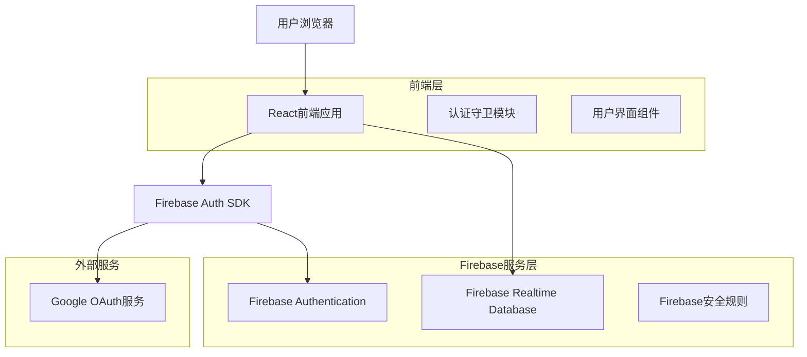
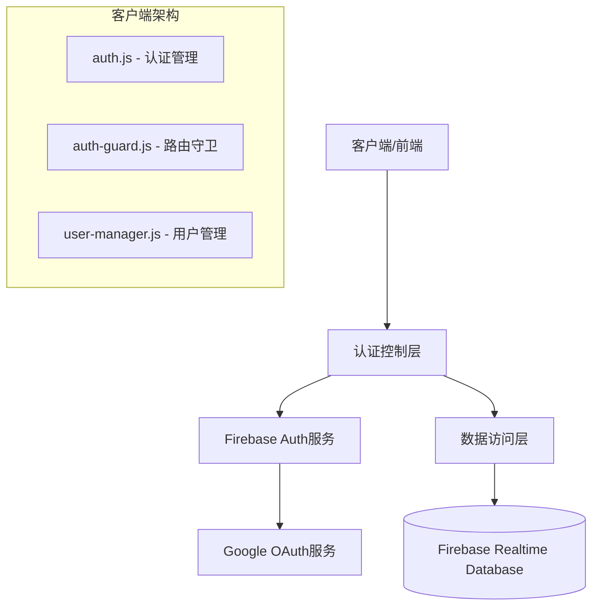
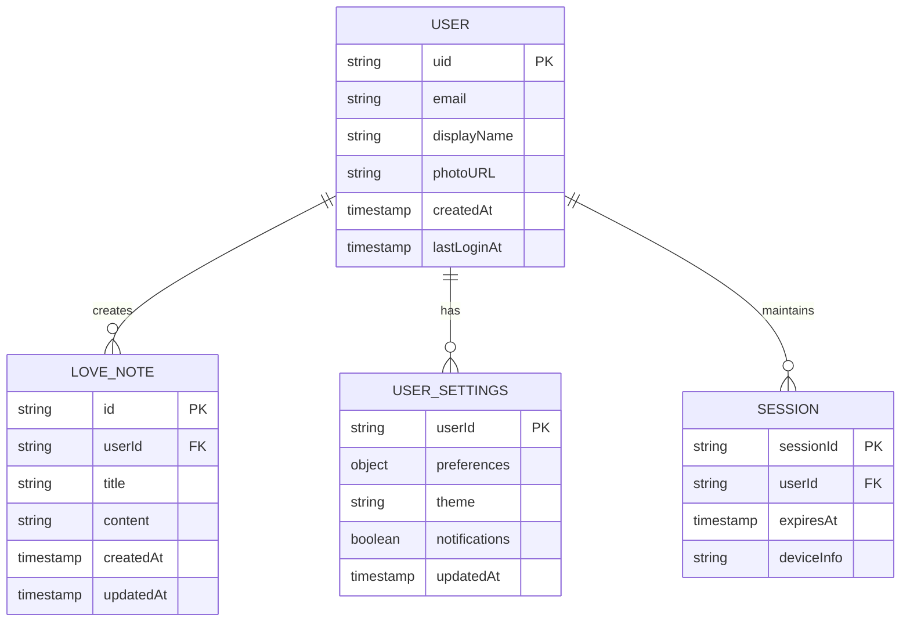

# Google Authentication 集成技术架构文档

## 1. 架构设计



## 2. 技术描述

- 前端：原生HTML/CSS/JavaScript + Tailwind CSS + Firebase SDK
- 后端：Firebase Authentication + Realtime Database
- 认证服务：Google OAuth 2.0

## 3. 路由定义

| 路由 | 用途 |
|------|------|
| /loginpange.html | 登录页面，提供Google登录功能 |
| /index.html | 主页面，显示情侣网站主要内容和功能 |
| / | 根路径，根据登录状态重定向到相应页面 |

## 4. API定义

### 4.1 核心API

**用户认证相关**

```javascript
// Google登录
firebase.auth().signInWithPopup(googleProvider)
```

请求参数：
| 参数名称 | 参数类型 | 是否必需 | 描述 |
|----------|----------|----------|------|
| provider | GoogleAuthProvider | true | Google认证提供商实例 |

响应数据：
| 参数名称 | 参数类型 | 描述 |
|----------|----------|------|
| user | User | 用户信息对象 |
| credential | AuthCredential | 认证凭据 |

示例：
```json
{
  "user": {
    "uid": "google:123456789",
    "displayName": "张三",
    "email": "zhangsan@gmail.com",
    "photoURL": "https://lh3.googleusercontent.com/..."
  }
}
```

**用户登出**

```javascript
firebase.auth().signOut()
```

响应数据：
| 参数名称 | 参数类型 | 描述 |
|----------|----------|------|
| success | boolean | 登出是否成功 |

**认证状态监听**

```javascript
firebase.auth().onAuthStateChanged(callback)
```

回调参数：
| 参数名称 | 参数类型 | 描述 |
|----------|----------|------|
| user | User\|null | 当前用户对象或null |

## 5. 服务架构图



## 6. 数据模型

### 6.1 数据模型定义



### 6.2 数据定义语言

**用户表 (users)**
```javascript
// Firebase Realtime Database 结构
{
  "users": {
    "[uid]": {
      "email": "user@gmail.com",
      "displayName": "用户姓名",
      "photoURL": "https://...",
      "createdAt": {".sv": "timestamp"},
      "lastLoginAt": {".sv": "timestamp"}
    }
  }
}
```

**爱情笔记表 (loveNotes)**
```javascript
{
  "loveNotes": {
    "[userId]": {
      "[noteId]": {
        "title": "笔记标题",
        "content": "笔记内容",
        "createdAt": {".sv": "timestamp"},
        "updatedAt": {".sv": "timestamp"}
      }
    }
  }
}
```

**用户设置表 (userSettings)**
```javascript
{
  "userSettings": {
    "[userId]": {
      "preferences": {
        "theme": "dark",
        "language": "zh-CN"
      },
      "notifications": true,
      "updatedAt": {".sv": "timestamp"}
    }
  }
}
```

**Firebase安全规则**
```javascript
{
  "rules": {
    "users": {
      "$uid": {
        ".read": "$uid === auth.uid",
        ".write": "$uid === auth.uid"
      }
    },
    "loveNotes": {
      "$uid": {
        ".read": "$uid === auth.uid",
        ".write": "$uid === auth.uid"
      }
    },
    "userSettings": {
      "$uid": {
        ".read": "$uid === auth.uid",
        ".write": "$uid === auth.uid"
      }
    }
  }
}
```

**初始化数据**
```javascript
// 用户首次登录时创建的默认数据
const initUserData = {
  users: {
    [uid]: {
      email: user.email,
      displayName: user.displayName,
      photoURL: user.photoURL,
      createdAt: firebase.database.ServerValue.TIMESTAMP,
      lastLoginAt: firebase.database.ServerValue.TIMESTAMP
    }
  },
  userSettings: {
    [uid]: {
      preferences: {
        theme: 'dark',
        language: 'zh-CN'
      },
      notifications: true,
      updatedAt: firebase.database.ServerValue.TIMESTAMP
    }
  }
};
```