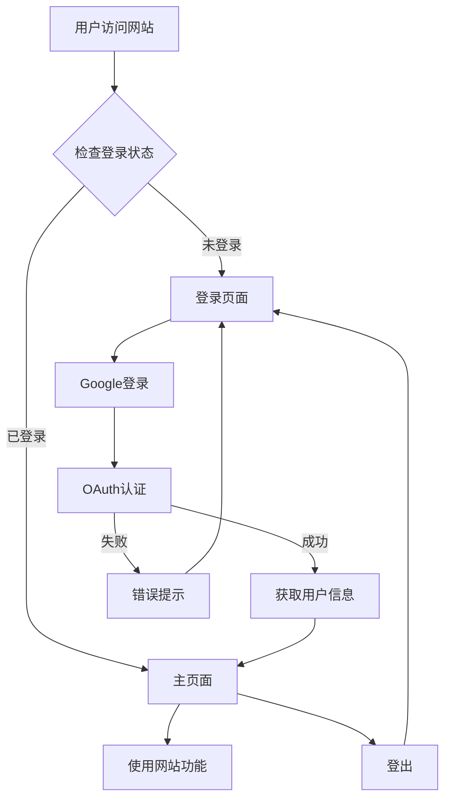

# Google Authentication 集成产品需求文档

## 1. 产品概述

为现有情侣主题网站集成Google Authentication认证系统，提供安全可靠的用户登录验证功能。
- 解决用户身份验证和数据安全问题，确保每对情侣的私密数据得到保护
- 目标用户为使用该情侣网站记录恋爱时光的情侣们，通过Google账号快速安全登录
- 提升用户体验，实现跨设备数据同步，打造个性化的情侣专属空间

## 2. 核心功能

### 2.1 用户角色

| 角色 | 注册方式 | 核心权限 |
|------|----------|----------|
| 访客用户 | 无需注册 | 仅可查看登录页面，无法访问主要功能 |
| 认证用户 | Google账号登录 | 可使用所有功能：音乐播放、日历查看、爱情笔记管理等 |

### 2.2 功能模块

我们的Google Authentication集成包含以下主要页面：
1. **登录页面**：Google登录按钮、登录状态检查、错误处理提示
2. **主页面增强**：用户信息显示、登出功能、个性化内容展示
3. **认证守卫**：路由保护、会话管理、自动跳转逻辑

### 2.3 页面详情

| 页面名称 | 模块名称 | 功能描述 |
|----------|----------|----------|
| 登录页面 | Google登录模块 | 显示Google登录按钮，处理OAuth认证流程，登录成功后跳转主页 |
| 登录页面 | 状态检查模块 | 检测用户登录状态，已登录用户自动跳转主页，显示加载动画 |
| 登录页面 | 错误处理模块 | 显示登录失败提示，网络错误处理，重试机制 |
| 主页面 | 用户信息模块 | 显示用户头像、姓名，个性化欢迎信息，用户设置入口 |
| 主页面 | 登出功能模块 | 提供登出按钮，清除会话数据，跳转回登录页 |
| 主页面 | 数据权限模块 | 基于用户ID的数据隔离，个人爱情笔记管理，隐私保护 |
| 认证守卫 | 路由保护模块 | 检查访问权限，未登录用户重定向，会话过期处理 |
| 认证守卫 | 会话管理模块 | Token验证，自动刷新机制，安全状态维护 |

## 3. 核心流程

**用户认证流程：**
用户访问网站 → 检查登录状态 → 未登录跳转登录页 → 点击Google登录 → OAuth认证 → 获取用户信息 → 跳转主页 → 享受个性化服务

**登出流程：**
用户点击登出 → 清除本地会话 → Firebase登出 → 跳转登录页

**会话管理流程：**
页面加载 → 检查Token有效性 → 有效则继续 → 无效则重新登录

## 4. 用户界面设计

### 4.1 设计风格

- **主色调**：深色背景 #22111a，粉色强调色 #f04299
- **次要色彩**：紫红色 #482336，浅粉色 #c992ad
- **按钮样式**：圆角设计，悬停渐变效果，符合现有主题
- **字体**：Noto Sans 和 Plus Jakarta Sans，保持一致性
- **布局风格**：居中卡片式布局，响应式设计
- **图标风格**：使用Google官方图标，配合现有SVG图标风格

### 4.2 页面设计概览

| 页面名称 | 模块名称 | UI元素 |
|----------|----------|--------|
| 登录页面 | 主容器 | 深色背景，居中卡片，圆角边框，粉色边框装饰 |
| 登录页面 | 标题区域 | 大号字体"Welcome Back"，副标题说明，粉色强调 |
| 登录页面 | 登录按钮 | Google官方样式，白色背景，悬停效果，阴影设计 |
| 登录页面 | 加载状态 | 粉色旋转动画，半透明遮罩，状态文字提示 |
| 主页面 | 用户信息栏 | 右上角头像，下拉菜单，用户名显示，登出选项 |
| 主页面 | 欢迎信息 | 个性化问候语，用户名集成，温馨提示文字 |

### 4.3 响应式设计

桌面优先设计，移动端自适应布局，支持触摸交互优化。登录页面在移动端采用全屏卡片设计，主页面用户信息在小屏幕下收缩为图标菜单。