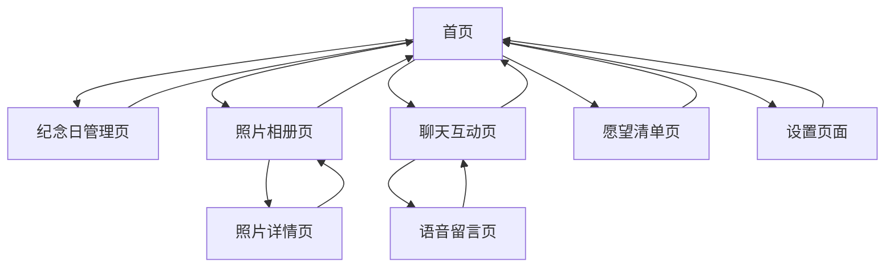

# 情侣网页产品需求文档

## 1. 产品概述
一个专为情侣设计的私密网页应用，提供情侣间的互动功能和美好回忆记录。
- 解决情侣间缺乏专属空间记录美好时光的问题，为情侣提供私密的数字化情感交流平台。
- 目标用户：热恋中的情侣、异地恋情侣、希望记录感情历程的伴侣。
- 产品价值：增进情侣感情，创造专属回忆空间，提升情感体验质量。

## 2. 核心功能

### 2.1 用户角色
| 角色 | 注册方式 | 核心权限 |
|------|----------|----------|
| 情侣用户 | Google账号注册 | 可创建情侣档案、邀请伴侣、使用所有功能 |
| 伴侣用户 | 接受邀请加入 | 与情侣用户享有相同权限，共享数据 |

### 2.2 功能模块
我们的情侣网页包含以下主要页面：
1. **首页**：情侣档案展示、快速导航、今日纪念。
2. **纪念日管理页**：重要日期记录、倒计时提醒、纪念日历史。
3. **照片相册页**：照片上传分享、相册分类、回忆时光轴。
4. **聊天互动页**：私密聊天、表情包、语音留言。
5. **愿望清单页**：共同目标设定、愿望实现追踪、未来规划。
6. **设置页面**：个人资料、隐私设置、账户管理。

### 2.3 页面详情
| 页面名称 | 模块名称 | 功能描述 |
|----------|----------|----------|
| 首页 | 情侣档案 | 显示情侣头像、昵称、在一起天数、关系状态 |
| 首页 | 快速导航 | 提供各功能模块的快速入口，今日待办事项 |
| 首页 | 今日纪念 | 展示今日是否有特殊纪念日，温馨提醒 |
| 纪念日管理页 | 日期记录 | 添加重要日期（相识、恋爱、生日等），自定义标签 |
| 纪念日管理页 | 倒计时提醒 | 显示下个重要日期倒计时，推送提醒通知 |
| 纪念日管理页 | 历史回顾 | 查看已过纪念日历史，添加当日回忆记录 |
| 照片相册页 | 照片管理 | 上传照片、添加描述、按时间/事件分类 |
| 照片相册页 | 相册分享 | 创建主题相册、设置访问权限、生成分享链接 |
| 照片相册页 | 时光轴 | 按时间线展示照片，回忆重要时刻 |
| 聊天互动页 | 私密聊天 | 实时消息发送、消息历史记录、消息搜索 |
| 聊天互动页 | 多媒体分享 | 发送图片、语音、表情包、位置信息 |
| 聊天互动页 | 特殊功能 | 情话生成器、每日情侣问题、心情记录 |
| 愿望清单页 | 目标设定 | 创建共同目标、设置完成时间、优先级排序 |
| 愿望清单页 | 进度追踪 | 更新完成状态、添加进度备注、庆祝完成 |
| 愿望清单页 | 未来规划 | 长期目标规划、梦想清单、旅行计划 |
| 设置页面 | 个人资料 | 修改头像昵称、个人信息、关系状态 |
| 设置页面 | 隐私设置 | 数据备份恢复、账户安全、隐私控制 |
| 设置页面 | 系统设置 | 通知偏好、主题切换、语言设置 |

## 3. 核心流程

**用户注册流程：**
用户通过Google账号注册 → 创建个人档案 → 生成邀请码 → 邀请伴侣加入 → 建立情侣关系 → 开始使用各项功能

**日常使用流程：**
登录首页查看今日纪念 → 查看/回复聊天消息 → 上传新照片到相册 → 更新愿望清单进度 → 记录今日心情

## 4. 用户界面设计

### 4.1 设计风格
- **主色调**：温馨粉色 (#FFB6C1) 和浪漫紫色 (#DDA0DD)
- **辅助色**：纯白色 (#FFFFFF) 和柔和灰色 (#F5F5F5)
- **按钮样式**：圆角设计，渐变色彩，悬浮阴影效果
- **字体**：中文使用思源黑体，英文使用 Roboto，主要字号 16px
- **布局风格**：卡片式设计，顶部导航，响应式布局
- **图标风格**：线性图标配合爱心、星星等浪漫元素

### 4.2 页面设计概览

| 页面名称 | 模块名称 | UI元素 |
|----------|----------|--------|
| 首页 | 情侣档案 | 圆形头像、渐变背景、爱心动画、天数计数器 |
| 首页 | 快速导航 | 卡片式图标按钮、柔和阴影、hover动效 |
| 纪念日管理页 | 日期记录 | 日历组件、标签系统、颜色分类、添加按钮 |
| 照片相册页 | 照片管理 | 瀑布流布局、图片预览、上传拖拽区域 |
| 聊天互动页 | 私密聊天 | 气泡式对话框、渐变背景、表情选择器 |
| 愿望清单页 | 目标设定 | 进度条、复选框、优先级标识、完成庆祝动画 |

### 4.3 响应式设计
采用移动端优先的响应式设计，支持手机、平板、桌面端访问。针对触屏设备优化交互体验，按钮大小适合手指点击，支持手势操作。