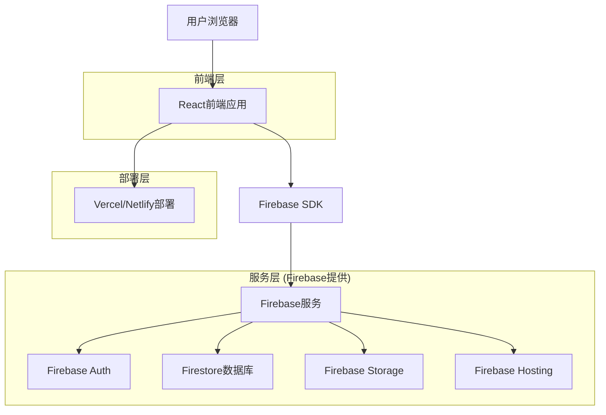
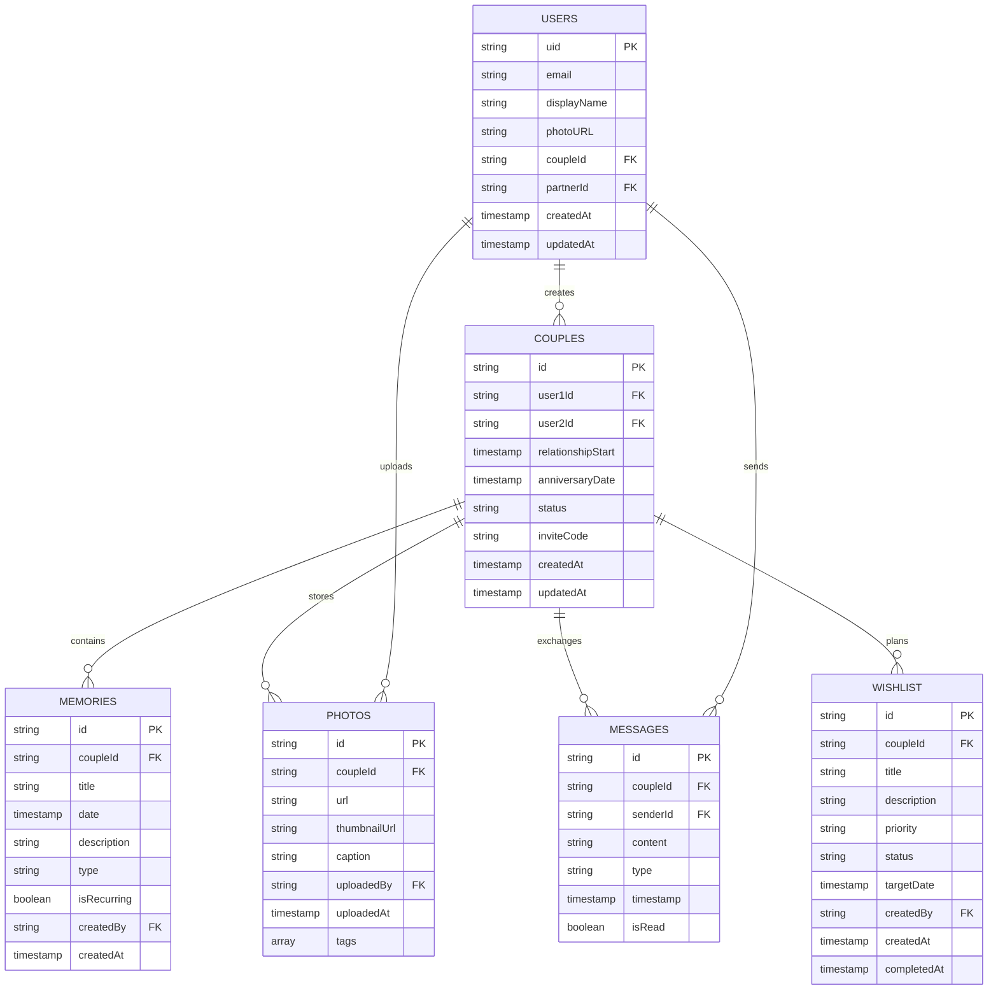

# 情侣网页技术架构文档

## 1. 架构设计



## 2. 技术描述

- **前端**: React@18 + TypeScript + Tailwind CSS + Vite
- **后端**: Firebase (Authentication + Firestore + Storage)
- **部署**: Vercel 或 Netlify 自动化部署
- **状态管理**: React Context + useReducer
- **UI组件库**: Headless UI + 自定义组件

## 3. 路由定义

| 路由 | 用途 |
|------|------|
| / | 首页，显示情侣档案和快速导航 |
| /login | 登录页面，Google认证入口 |
| /memories | 纪念日管理页面，重要日期记录 |
| /photos | 照片相册页面，照片上传和管理 |
| /chat | 聊天互动页面，私密对话 |
| /wishlist | 愿望清单页面，共同目标管理 |
| /settings | 设置页面，个人资料和系统设置 |

## 4. Firebase服务配置

### 4.1 Firebase Authentication

**Google登录配置**
```javascript
// firebase配置
const firebaseConfig = {
  apiKey: process.env.REACT_APP_FIREBASE_API_KEY,
  authDomain: process.env.REACT_APP_FIREBASE_AUTH_DOMAIN,
  projectId: process.env.REACT_APP_FIREBASE_PROJECT_ID,
  storageBucket: process.env.REACT_APP_FIREBASE_STORAGE_BUCKET,
  messagingSenderId: process.env.REACT_APP_FIREBASE_MESSAGING_SENDER_ID,
  appId: process.env.REACT_APP_FIREBASE_APP_ID
};

// Google认证提供者
const googleProvider = new GoogleAuthProvider();
```

### 4.2 Firestore数据库结构

**用户集合 (users)**
```typescript
interface User {
  uid: string;
  email: string;
  displayName: string;
  photoURL: string;
  coupleId?: string;
  partnerId?: string;
  createdAt: Timestamp;
  updatedAt: Timestamp;
}
```

**情侣档案集合 (couples)**
```typescript
interface Couple {
  id: string;
  user1Id: string;
  user2Id: string;
  relationshipStart: Timestamp;
  anniversaryDate: Timestamp;
  status: 'pending' | 'active';
  inviteCode: string;
  createdAt: Timestamp;
  updatedAt: Timestamp;
}
```

**纪念日集合 (memories)**
```typescript
interface Memory {
  id: string;
  coupleId: string;
  title: string;
  date: Timestamp;
  description?: string;
  type: 'anniversary' | 'birthday' | 'custom';
  isRecurring: boolean;
  createdBy: string;
  createdAt: Timestamp;
}
```

**照片集合 (photos)**
```typescript
interface Photo {
  id: string;
  coupleId: string;
  url: string;
  thumbnailUrl: string;
  caption?: string;
  uploadedBy: string;
  uploadedAt: Timestamp;
  tags: string[];
}
```

**聊天消息集合 (messages)**
```typescript
interface Message {
  id: string;
  coupleId: string;
  senderId: string;
  content: string;
  type: 'text' | 'image' | 'voice';
  timestamp: Timestamp;
  isRead: boolean;
}
```

**愿望清单集合 (wishlist)**
```typescript
interface WishItem {
  id: string;
  coupleId: string;
  title: string;
  description?: string;
  priority: 'low' | 'medium' | 'high';
  status: 'pending' | 'in-progress' | 'completed';
  targetDate?: Timestamp;
  createdBy: string;
  createdAt: Timestamp;
  completedAt?: Timestamp;
}
```

### 4.3 Firebase Storage结构

```
/couples/{coupleId}/
  /photos/
    /{photoId}.jpg
    /thumbnails/{photoId}_thumb.jpg
  /voices/
    /{messageId}.mp3
  /avatars/
    /{userId}_avatar.jpg
```

## 5. 数据模型

### 5.1 数据模型定义



### 5.2 Firestore安全规则

```javascript
rules_version = '2';
service cloud.firestore {
  match /databases/{database}/documents {
    // 用户只能访问自己的数据
    match /users/{userId} {
      allow read, write: if request.auth != null && request.auth.uid == userId;
    }
    
    // 情侣数据只能被情侣双方访问
    match /couples/{coupleId} {
      allow read, write: if request.auth != null && 
        (request.auth.uid == resource.data.user1Id || 
         request.auth.uid == resource.data.user2Id);
    }
    
    // 纪念日数据访问控制
    match /memories/{memoryId} {
      allow read, write: if request.auth != null && 
        exists(/databases/$(database)/documents/couples/$(resource.data.coupleId)) &&
        (request.auth.uid in get(/databases/$(database)/documents/couples/$(resource.data.coupleId)).data.values());
    }
    
    // 照片数据访问控制
    match /photos/{photoId} {
      allow read, write: if request.auth != null && 
        exists(/databases/$(database)/documents/couples/$(resource.data.coupleId)) &&
        (request.auth.uid in get(/databases/$(database)/documents/couples/$(resource.data.coupleId)).data.values());
    }
    
    // 消息数据访问控制
    match /messages/{messageId} {
      allow read, write: if request.auth != null && 
        exists(/databases/$(database)/documents/couples/$(resource.data.coupleId)) &&
        (request.auth.uid in get(/databases/$(database)/documents/couples/$(resource.data.coupleId)).data.values());
    }
    
    // 愿望清单数据访问控制
    match /wishlist/{wishId} {
      allow read, write: if request.auth != null && 
        exists(/databases/$(database)/documents/couples/$(resource.data.coupleId)) &&
        (request.auth.uid in get(/databases/$(database)/documents/couples/$(resource.data.coupleId)).data.values());
    }
  }
}
```

## 6. 部署配置

### 6.1 Vercel部署配置

**vercel.json**
```json
{
  "framework": "vite",
  "buildCommand": "npm run build",
  "outputDirectory": "dist",
  "installCommand": "npm install",
  "env": {
    "REACT_APP_FIREBASE_API_KEY": "@firebase_api_key",
    "REACT_APP_FIREBASE_AUTH_DOMAIN": "@firebase_auth_domain",
    "REACT_APP_FIREBASE_PROJECT_ID": "@firebase_project_id",
    "REACT_APP_FIREBASE_STORAGE_BUCKET": "@firebase_storage_bucket",
    "REACT_APP_FIREBASE_MESSAGING_SENDER_ID": "@firebase_messaging_sender_id",
    "REACT_APP_FIREBASE_APP_ID": "@firebase_app_id"
  },
  "rewrites": [
    {
      "source": "/(.*)",
      "destination": "/index.html"
    }
  ]
}
```

### 6.2 环境变量配置

**.env.example**
```
REACT_APP_FIREBASE_API_KEY=your_api_key_here
REACT_APP_FIREBASE_AUTH_DOMAIN=your_project.firebaseapp.com
REACT_APP_FIREBASE_PROJECT_ID=your_project_id
REACT_APP_FIREBASE_STORAGE_BUCKET=your_project.appspot.com
REACT_APP_FIREBASE_MESSAGING_SENDER_ID=your_sender_id
REACT_APP_FIREBASE_APP_ID=your_app_id
```

## 7. 开发和维护指南

### 7.1 项目结构
```
src/
├── components/          # 可复用组件
├── pages/              # 页面组件
├── hooks/              # 自定义Hook
├── contexts/           # React Context
├── services/           # Firebase服务
├── utils/              # 工具函数
├── types/              # TypeScript类型定义
└── styles/             # 样式文件
```

### 7.2 扩展性考虑
- **模块化设计**：每个功能模块独立，便于后续添加新功能
- **组件复用**：通用组件设计，减少重复代码
- **类型安全**：使用TypeScript确保代码质量
- **状态管理**：使用Context API，便于状态共享和管理
- **API抽象**：Firebase服务封装，便于后续迁移或扩展